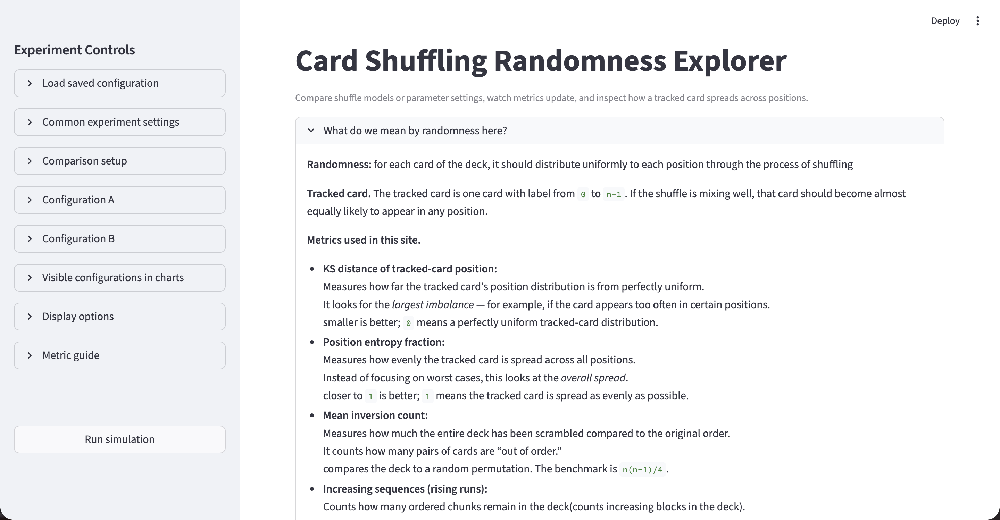
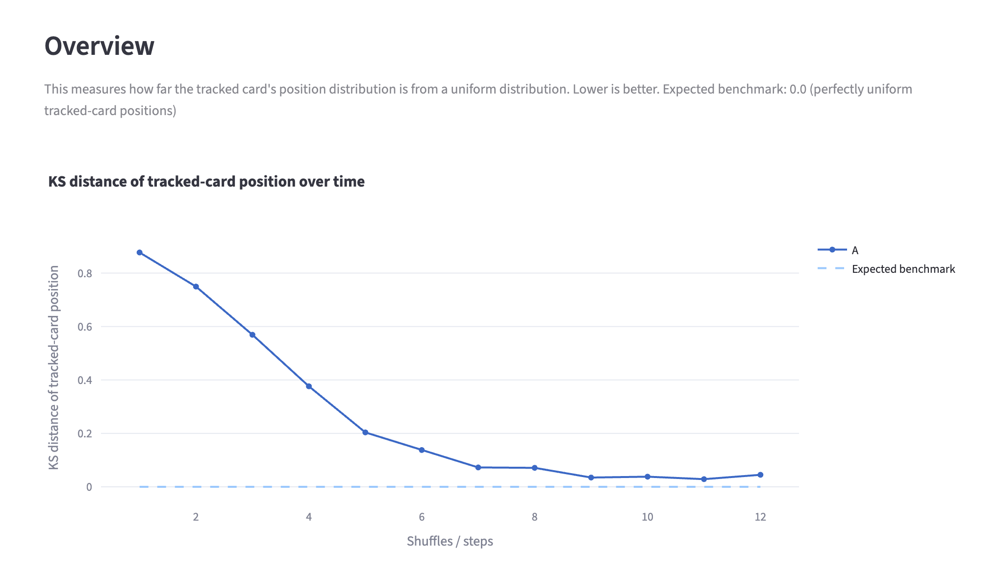
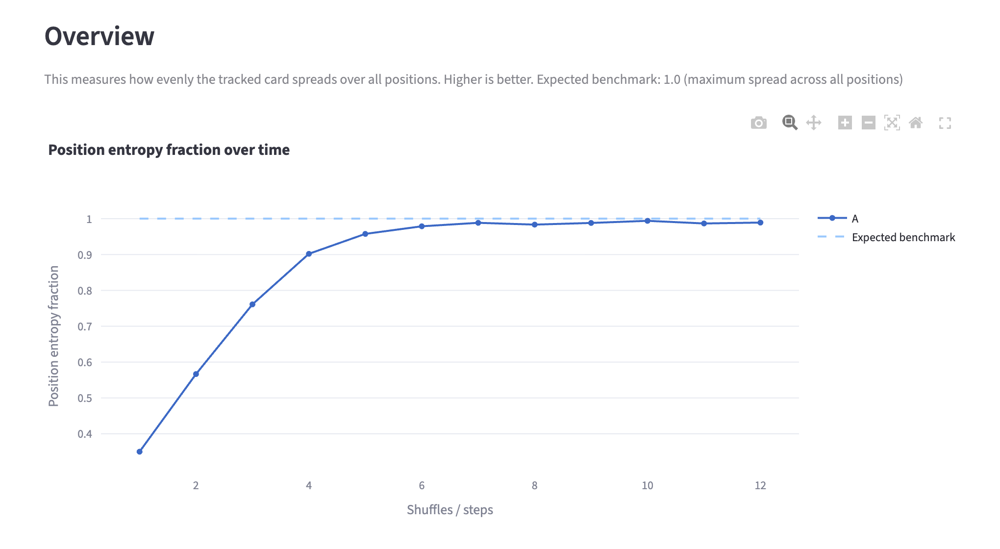
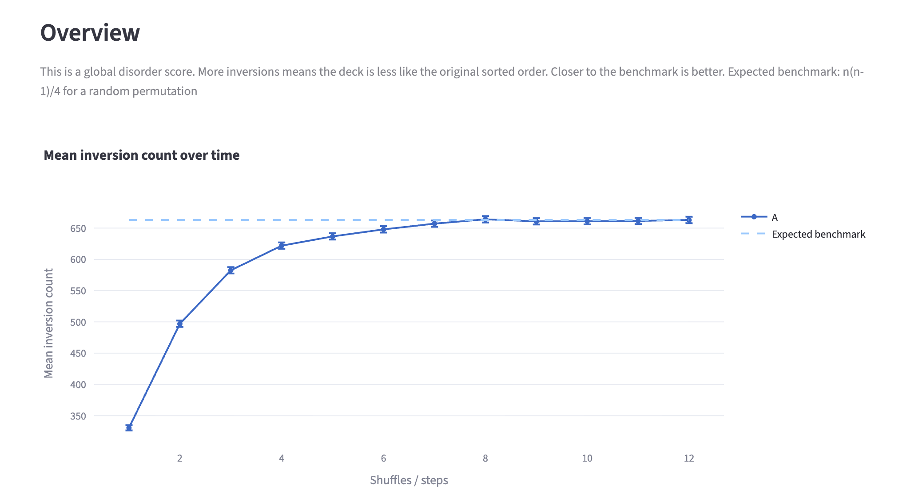
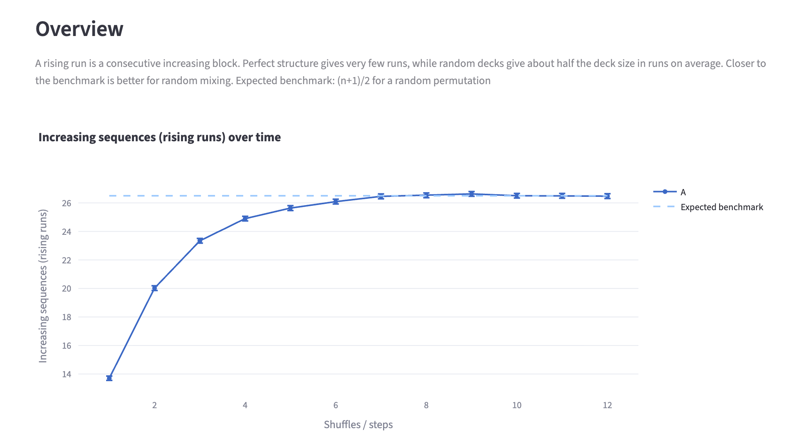
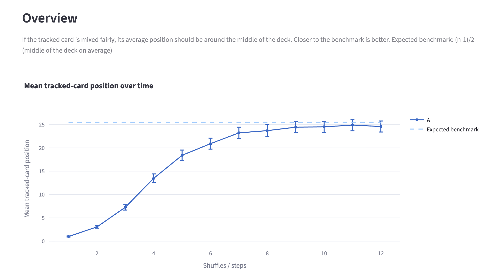

# Shuffle Randomness Explorer


## Link for Presentation Slides


https://www.canva.com/design/DAHETaTYKc4/rZOgTrrLFHqO9d05iXxYCQ/edit?utm_content=DAHETaTYKc4&utm_campaign=designshare&utm_medium=link2&utm_source=sharebutton


---
## 📚 Table of Contents

* [Overview](#overview)
* [Core Features](#core-features)
* [Demo](#demo)
* [Shuffle Methods](#shuffle-methods)
* [Metrics](#metrics)
* [Latest Improvement](#latest-improvement)
* [Tech Stack](#tech-stack)
* [How to Run](#how-to-run)
* [Configuration JSON Format](#configuration-json-format)
* [Project Structure](#project-structure)
* [Implementation Details](#implementation-details)
* [Why I build this](#why-i-built-this)
* [Developer Notes](#developer-notes)
* [Limitations](#limitations)
* [Future Improvements](#future-improvements)

---

## Overview

This project explores a simple but deep question:

> **When is a deck of cards "random enough"?**

Instead of assuming randomness, this app:

* simulates different shuffle processes
* tracks randomness over time
* visualizes how distributions evolve

Built as an interactive **Streamlit app**, it allows experimentation with shuffle models and parameters.

This project combines simulation, probability theory, and interactive visualization to provide an intuitive understanding of randomness in card shuffling.

---

## Core Features

* Interactive UI (Streamlit)
* Compare multiple shuffle configurations
* Real-time metric visualization
* Track a specific card across positions
* Histogram + 3D visualization
* Export results (CSV)
* Save / load configurations (JSON)
* Cheat mode (simulate biased shuffles)
* Perfect riffle analysis (cycle detection)

---

## Demo

### Main Interface


---

## Shuffle Methods

* **Riffle shuffle (GSR model)**
  Probabilistic split + interleave

* **Overhand shuffle (Pemantle)**
  Random chunking + reversal

* **Pile shuffle**
  Distribution into piles + collection

* **Perfect riffle (deterministic)**
  No randomness → reveals hidden structure and cycles

---

## Metrics

This project uses multiple perspectives to measure randomness:

(All figures are generated using the default riffle shuffle.)

### 1. KS Distance (Tracked Card)

* Measures deviation from uniform distribution
* 0 → perfectly uniform
* **Lower is better (less biased)**



### 2. Position Entropy

* Measures spread of probability
* Lower → concentrated in certain positions
* **Closer to 1 is better**



### 3. Inversion Count

* Global disorder measure
* 0 → completely ordered
* Benchmark: `n(n-1)/4` (expected for random deck)



### 4. Rising Runs

* Measures local structure
* fewer runs → more structure remains
* Benchmark: `(n+1)/2` (expected for random deck)


 
### 5. Mean Position

* Checks positional bias
* Benchmark: middle of deck (expected for random deck)



---

## Latest Improvement

Based on the latest version of the app, the following improvements have been added:

### 🔹 Multi-page UI

* Overview
* Tracked Card
* Advanced Diagnostics
* Perfect Riffle
* Downloads

### 🔹 Advanced Diagnostics

* Top/Bottom probability per card
* Extreme probability visualization
* Metric vs metric comparison plots

### 🔹 3D Visualization

* Step × Position × Probability
* Shows how probability mass spreads over time

### 🔹 Multi-metric Overlay

* Compare different metrics on one chart
* Optional normalization

### 🔹 Perfect Riffle Analysis

* Detect return-to-original cycles
* Deterministic deck path tracking

### 🔹 Parallel Simulation

* Uses `ThreadPoolExecutor` for faster Monte Carlo runs
* enables parallel execution of simulation tasks

### 🔹 Cached Computation

* `@st.cache_data` avoids recomputation

---

## Tech Stack

* Python
* Streamlit
* Plotly
* Pandas

---

## How to Run

```bash
git clone https://github.com/AmberR-pua/shuffle-randomness-explorer.git
cd shuffle-randomness-explorer

pip install -r requirements.txt
streamlit run app.py
```

---

## Configuration JSON Format

This project supports saving and loading experiment configurations using JSON files.

#### Example Configuration (Simplified)

```json
{
  "method": "riffle",
  "steps_list": [1, 2, 3, 5, 10],
  "deck_size": 52,
  "tracked_card": 0,
  "trials": 600,

  "shuffle_params": {
    "riffle_cut_p": 0.5,
    "p_overhand": 0.5,
    "piles_k": 7,
    "pile_random_pickup": true,
    "cheat_mode": "none",
    "cheat_cards": 0,
    "perfect_riffle": false,
    "perfect_riffle_start": "left"
  }
}
```

#### Full Configuration

A full configuration file (including UI state and multiple configurations) looks like this:

```json
{
  "common_settings": { ... },
  "display_settings": { ... },
  "shuffle_configurations": [ ... ]
}
```

See example file:
`riffle(cut_p=0.50)_configuration.json`

---

#### Structure

#### common_settings

* deck_size, tracked_card, trials, seed
* parallel settings (max_workers, batch_size)

#### display_settings

* current page and UI mode
* metric selection and visualization options


#### shuffle_configurations


* `method`: riffle / overhand / pile
* `steps_list`: number of shuffles
* `shuffle_params`: parameters for each method

#### Notes

* JSON files allow saving and restoring experiments
* Supports multiple configurations for comparison
* Enables reproducible simulation results


---

## Project Structure

```
.
├── app.py                  # Streamlit UI
├── shuffle_main.py         # simulation + metrics
├── requirements.txt
├── shuffle_run_local.txt   # generated local results
├── README.md
├── csv_file/               # generated outputs
```

---

## Implementation Details

* Monte Carlo simulation
* Parallel execution for trials
* Dataclass-based config system
* Modular design (UI vs simulation)
* Statistical estimation of distributions

---

## Why I built this

I wanted to build something that is:

* simple to understand (cards)
* but still involves probability and simulation
* interactive instead of static
* and easy to experiment with

It also helped me practice:

* structuring a small project
* thinking about how to measure “randomness”
* separation between simulation logic and UI
* designing UI from a user perspective

---

## Developer Notes

### ➕ How to Add a New Shuffle Technique

To extend this project:

1. Implement a new shuffle function in `shuffle_main.py`

```python
def my_shuffle(deck, rng):
    # your logic
    pass
```

2. Register it in `build_shuffle_config`

3. Add UI controls in `app.py`

4. (Optional) Add scheduling logic:

```python
schedule_my_shuffle(...)
```

5. Add name + parameters for display

---

### 💡 Tips

* Keep shuffle **in-place** (mutate deck)
* Use `rng` for reproducibility
* Ensure compatibility with metrics pipeline

---

## Limitations

* Simulation can be slow for large trials
* Inversion count is O(n²)
* Depends on pseudo-random generator

---

## Future Improvements

* Faster algorithms
* More shuffle models
* Better statistical confidence intervals
* Deploy online

---

## Final Note

This is a project about combining mathematical knowledge with coding skill, involving multiple aspects such as probability, simulation, and visualization to explore randomness in an intuitive and interactive way.

---
